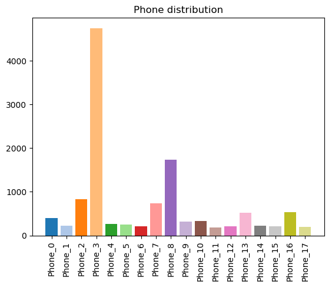

# Udacity's Machine Learning Engineer Nanodegree
## Capstone Proposal
Benoît Boucher, 2018-07-20

## Proposal

### Domain Background

CONTXTFUL is a web marketing company that specializes in using smartphone physical sensor data, such as the gyroscope and acceleration sensors, to detect the context of users. For instance, are they at rest or walking? Are they looking at their screen or not?

Other entities have tackled a similar problem. For instance, academics Ordóñez and Roggen used [Deep Convolutional and Long Short-Term Memory (LTSM) Recurrent Neural Networks for Multimodal Wearable Activity Recognition](http://www.mdpi.com/1424-8220/16/1/115/htm). Among other things, their article shows how to solve two families of human activity recognition problems. Another good example comes from the company _Sentiance_ who also use LSTM to analyze sensor data, which allows them to [recognize behavioral patterns and interpret real-time context](http://www.sentiance.com/2017/04/25/predictive-analytics-applying-deep-learning-on-mobile-sensor-data/). _Sentiance_ calls it [The Internet of You](http://www.sentiance.com/2017/02/27/internet-of-you/). It is also worth citing David Smolders who wrote in his blog about [Predicting physical activity based on smartphone sensor data using CNN + LSTM](https://blog.goodaudience.com/predicting-physical-activity-based-on-smartphone-sensor-data-using-cnn-lstm-9182dd13b6bc). In his study, he used the [Human Activity Recognition Using Smartphones Data Set](https://archive.ics.uci.edu/ml/datasets/human+activity+recognition+using+smartphones) from UCI.

For CONTXTFUL, interpreting real-time human behavior helps them push context-aware ads to people when they are most receptive.

One of the problems that CONTXTFUL encountered is detecting the type of phone used to generate this data. This is relevant because every phone has different sensors which report their own version of sensor data that can be classified into their different categories (active, at rest, looking at screen, etc.). Knowing the make and model of the phone would allow CONTXTFUL to develop and use make-model specific Machine-Learning models, which would result in faster compute time and more accurate results.

Up until now, CONTXTFUL has been extracting the make-model information from a special collector agent, but this agent has problems of its own and it would be preferable to skip it entirely.

My first personal motivation for working with CONTXTFUL is because it is a wonderful opportunity to work on a real-world problem, as opposed to a toy problem. Secondly, the tech lead is an acquaintance of mine, so I'm helping a friend. Finally, this is a great foot in the door for future collaboration or employment.
 

### Problem Statement

The primary goal is to identify smartphones' make-model based solely on their physical data. This can be measured by the F1 score.

As a secondary target, it would be interesting to cluster the phones and see if a natural separation of the samples occur based on their make-models. This can be measured by weighting the representation of each phone make-models into the clusters.   

### Datasets and Inputs

The dataset is derived from a measure of a phone's physical sensors. What CONTXTFUL calls a _raw_data_vector_ is generated every second and includes all data points from the various sensors (X-Y-Z gyroscope, X-Y-Z accelerometer, etc) sampled at the phone's sample rate. This rate varies by model, but is generally in the range of 16-32 Hz. Consequently, _raw_data_vectors_ do not have a consistent length. 

Being proprietary, the _raw_data_vector_ will not be available to the public in this project.

What will be available for our ML models is what CONTXTFUL refers to as _full_stat_vector_, which is a features vector engineered from the _raw_data_vector_. The _full_stat_vector_ is a vector of consistent length containing a slew of various statistical metrics. For instance: maximum_gyroscope_speed_Z, first_derivate_linear_acceleration_Z, mean_euclidean_speed, etc. The total number of features is 1652.
 
 We provide an anonymized version of the _full_stat_vector_, in which specific information about the phones' make-model and the featured statistics has been removed. Use a simple `Pandas.read_pickle` command to uncompress the [data set](https://github.com/Fluzzroz/Contxtful-phone-model/blob/master/dataset.xz). 

Physical sensor data is generated by phones while users browse websites on which the CONTXTFUL plugin is installed. The specific websites wishes to remain anonymous.

There are 12 110 samples. Since they were obtained from real-life browser visits, the distribution is far from being uniform, as per the bar chart below.

### Solution Statement

The solution to the primary goal is to apply a Supervised Learning model. Many classifiers will be tried until one with a good accuracy is found. The F1 score of predicted labels is the metric to use.

For the secondary goal, various Unsupervised Learning models will be tried. A metric that measures the disparity between phones from each cluster will indicate how good they are separated. 

A Random Search or Grid Search algorithm will be run to optimize the hyper-parameters. The best hyper-parameters found will be saved to disk as to allow anyone to be able to retrain the same model and obtain the same results.

In fact, to be completely replicable, we will provide access to the Python code behind every model tried.

### Benchmark Model

For the classification problem, CONTXTFUL has obtained good results using Linear Discriminent Analysis (LDA), which is also in line with the idea to "cluster" the data since at its core, it is a supervised dimensionality reduction algorithm. 

For the clustering problem, CONTXTFUL did not obtain satisfying results. However, their current best approach is with the Gaussian Mixture.

The results to both problems are measurable. While the classificition is the classic F1 score, the clustering will be measured by a homebrew metric because the problem is very specific in nature. In both cases, visual aid can be provided:
* A bar chart of accuracy per label for Classification.
* A series of bar charts showing what each cluster contain in terms of labels. 

### Evaluation Metrics

**F1 Score:** We will use the F1 score instead of the simple accuracy score because our target data is not uniform. It is the harmonic mean of _precision_ and _recall_ where precision describes how many selected items were relevant and recall scores how many relevant items were selected. 

_F1 = 2 * (precision * recall) / (precision + recall)_

where: 

_precision = true_positives / (true_positives + false_positives)_

_recall = true_positives / (true_positives + false_negatives)_

**Clustering Score** Because of the unique nature of the problem (specifically: verifying that labels are grouped into unique clusters), we came up with a homemade metric to measure the quality of our clustering. The basis for the calculation is a matrix where the rows are the true labels, the columns are the new clusters, and each item(i,j) in the matrix is the percentage of samples that has label(i) and was classified into cluster(j). Every entry in this matrix will be passed into the following special function:
 
 _f(x) = 2 * |x - 0.5|_ 

This function was calibrated to return a score close to 1 if the input ratio is either close to 0 or 1. A good score signifies that the labels were indeed clustered into clusters in an exclusive fashion. In other words, a specific label should be found inside a unique cluster and nowhere else. We then average the score of every item in the label-cluster matrix to give the final score.

There is a caveat to this metric: it is highly sensitive to outliers. Clusters can ultimately contain only one outlier, thus fooling the calculation and generating a very high score.

### Project Design

The following workflow will be repeated twice, once for each separate objective:
**General Workflow**
1. Reproduce the results of CONTXTFUL.
2. Try various algorithms appropriate for the goal. See the list below.
3. Once a good approach is found, optimize the hyperparameters, if any. This can be done via BIC score for Gaussian Mixture, or Random Search Cross Validation for all other techniques.
4. Present the results.

Note: Because the data is proprietary and confidential to CONTXTFUL, I am not at liberty to show the details of the data pre-processing, like the feature engineering part that transformed a _raw_data_vector_ into a _full_stat_vector_. This is why there is no such step in my workflow.

**Algorithms for Classification**
1. Support Vector Machine
2. Neural Network
3. Random Forest

**Algorithms for Clustering**
1. Mean Shift
2. Density-Based Spatial Clustering of Applications with Noise (DBSCAN)
3. Agglomerative
4. K Means
